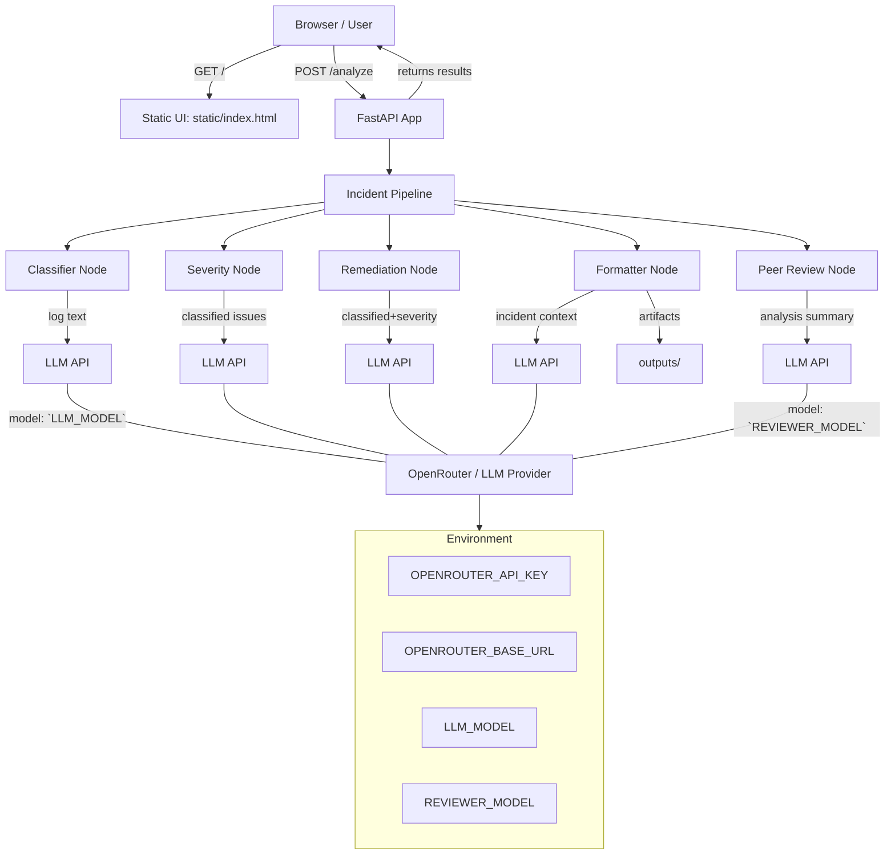

# DevOps Incident Analyzer Architecture

## Overview
This architecture describes the flow of the DevOps Incident Analyzer:

- A user submits log input through the web UI or API
- FastAPI handles the request and sends the incident through a graph-based pipeline
- Each pipeline node uses LLM calls to analyze, triage, remediate, format, and optionally peer-review the incident
- Generated artifacts are persisted to disk and returned in the API response

## Components

- `main.py`
  - FastAPI application entrypoint
  - exposes `/` static UI, `/analyze` log submission, and `/download/{incident_id}`
- `graph/pipeline.py`
  - builds and compiles the incident processing pipeline
  - defines ordered nodes: classify -> reason_severity -> map_remediation -> format_outputs -> ai_review
- Graph nodes
  - `graph/nodes/classifier.py` — extract issue classifications from logs
  - `graph/nodes/severity.py` — triage severity levels
  - `graph/nodes/remediation.py` — generate remediation plans
  - `graph/nodes/formatter.py` — build summary, Slack card, Jira ticket, checklist, and analysis objects
  - `graph/nodes/reviewer.py` — optional peer review step
- `llm/client.py`
  - central adapter for OpenRouter/OpenAI chat calls
  - selects `LLM_MODEL` for general analysis and `REVIEWER_MODEL` for peer review
- `static/`
  - frontend assets mounted at `/static`
- `sample_logs/`
  - static log examples mounted at `/sample_logs`
- `outputs/`
  - incident artifact storage directory

## Data Flow


```

## Notes

- The analyzer is designed as a modular graph pipeline: each stage is isolated and can be extended independently.
- The `reviewer` node is optional and may return `review: None` if the reviewer model fails.
- Outputs are written to `outputs/<incident_id>` as `summary.txt`, `slack_card.json`, `jira_ticket.json`, `checklist.md`, `analysis.json`, and optionally `review.json`.
- The service relies on the OpenRouter-compatible LLM gateway configured by the `.env` file.

## Deployment

- Run from `hackathon/` root using `uvicorn main:app --host 127.0.0.1 --port 8000`
- Ensure `.env` contains valid OpenRouter credentials and model names
- Access the UI at `http://127.0.0.1:8000`
- Use `/analyze` to submit logs and `/download/{incident_id}` to retrieve artifacts
